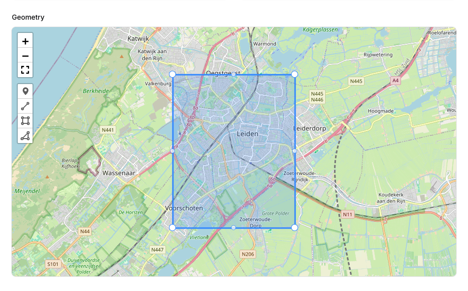

# Filament geometry

<div class="filament-hidden">

[](https://packagist.org/packages/swisnl/filament-geometry)
[](LICENSE.md)
[](https://plant.treeware.earth/swisnl/filament-geometry)
[](https://github.com/swisnl/filament-geometry/actions?query=workflow%3Arun-tests+branch%3Amain)
[](https://github.com/swisnl/filament-geometry/actions?query=workflow%3A"Fix+PHP+Code+Styling"+branch%3Amain)
[](https://packagist.org/packages/swisnl/filament-geometry)
[](https://www.swis.nl)


</div>

> [!WARNING]
> Work in progress, not stable yet!
>

## Installation

You can install the package via composer:

```bash
composer require swisnl/filament-geometry
```

> **Important**
> This package requires Filament 4.x. For Filament 3.x compatibility, use version 0.3.x of this package.

In an effort to align with Filament's theming methodology you will need to use a custom theme to use this plugin.

> [!IMPORTANT]
> If you have not set up a custom theme and are using Filament Panels follow the instructions in the [Filament Docs](https://filamentphp.com/docs/4.x/styling/overview#creating-a-custom-theme) first.

After setting up a custom theme add the plugin's views to your theme css file or your app's css file if using the standalone packages.

```css
@source '../../../../vendor/swisnl/filament-geometry/resources/**/*.blade.php';
```

## Component

### Geometry Field

The **Geometry** field displays a leaflet map, with a set of configuration options.



## Usage

### Geometry Field

> [!IMPORTANT]  
> This field is designed to be used in conjunction with a database column of type `(MULTI)POINT`, `(MULTI)LINESTRING`, `(MULTI)POLYGON` or `GEOMETRY`. It currently does not support geometries with mixed types i.e. `GEOMETRYCOLLECTION`. This field expects the attribute value to be a valid [GeoJSON](https://geojson.org/) string. Make sure your model attribute stores and retrieves GeoJSON data as a string.

The form field can be used with no options, by simply adding this to your Filament form schema:

```php
use Swis\Filament\Geometry\Enums\DrawMode;
use Swis\Filament\Geometry\Forms\Geometry;
...
->schema[
    ...
    Geometry::make('location')
        ->drawModes([
            DrawMode::Marker,
            DrawMode::Polygon,
            DrawMode::Polyline,
            DrawMode::Rectangle,
        ]),
    ...
]
```

#### Full options

The full set of options is as follows. Some option methods support closures, as well as direct values.

```php
use Swis\Filament\Geometry\Bounds;
use Swis\Filament\Geometry\Enums\ControlPosition;
use Swis\Filament\Geometry\Enums\DrawMode;
use Swis\Filament\Geometry\Forms\Geometry;
use Swis\Filament\Geometry\Icons\Marker;
use Swis\Filament\Geometry\TileLayers\Carto;

...

Geometry::make('location')
    ->label(__('Location'))

    // Map configuration
    ->maxZoom(16)
    ->minZoom(4)
    ->center(52.164206390898904, 4.491920969490259)
    ->zoom(15)
    ->bounds(Bounds::make(49.5, -11, 61, 2)) // Example for British Isles
    ->tileLayer(Carto::make())

    // Marker configuration
    ->markerIcon(Marker::make('#3b82f6'))
    
    // Controls
    ->showFullscreenControl(true)
    ->showZoomControl(true)
    ->showAttributionControl(true)
    ->geoSearch(null)
    ->drawModes([
        DrawMode::Polygon,
        DrawMode::Rectangle,
    ])
    ->multipart(false)
    ->drawControlPosition(ControlPosition::TopRight)
```

## Testing

```bash
composer test
```

## Changelog

Please see [CHANGELOG](https://github.com/swisnl/filament-geometry/blob/main/CHANGELOG.md) for more information on what has changed recently.

## Contributing

Please see [CONTRIBUTING](https://github.com/swisnl/filament-geometry/blob/main/.github/CONTRIBUTING.md) for details.

## Security Vulnerabilities

Please review [our security policy](https://github.com/swisnl/filament-geometry/security/policy) on how to report security vulnerabilities.

## Credits

- [Pjotr van der Horst](https://github.com/pjotrvdh)
- [Jasper Zonneveld](https://github.com/JaZo)
- [All Contributors](https://github.com/swisnl/filament-geometry/contributors)

## License

The MIT License (MIT). Please see [License File](https://github.com/swisnl/filament-geometry/blob/main/LICENSE.md) for more information.

## SWIS ❤️ Open Source

[SWIS](https://www.swis.nl) is a web agency from Leiden, the Netherlands. We love working with open source software.
